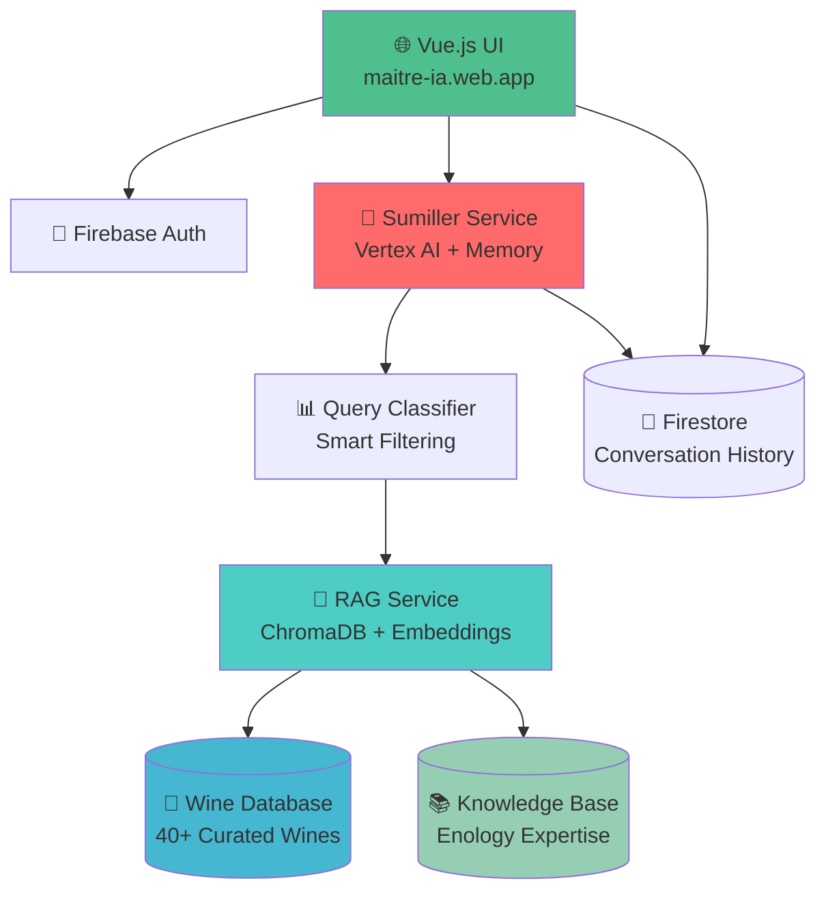

# 🍷 Sumy v2 - Sumiller Virtual con IA

[](https://opensource.org/licenses/MIT)
[](https://firebase.google.com/)
[](https://cloud.google.com/)
[](https://vuejs.org/)
[](https://python.org/)

> **Sumy** es un sumiller virtual inteligente que combina IA generativa, RAG (Retrieval-Augmented Generation) y conocimiento enológico especializado para brindar recomendaciones de vinos personalizadas y educación gastronómica avanzada.

## 🌟 Características Destacadas

### 🧠 Inteligencia Artificial Avanzada
- **IA Generativa**: Integración con **Vertex AI Gemini 2.0 Flash** para conversaciones naturales y expertas
- **RAG Inteligente**: Sistema de recuperación de información que combina base de datos de vinos con conocimiento enológico
- **Clasificación Automática**: Detección inteligente del tipo de consulta (búsqueda, teoría, maridaje, etc.)
- **Trazabilidad Completa**: Seguimiento detallado de las fuentes de información utilizadas

### 🍷 Base de Conocimiento Especializada
- **40+ Vinos Curados**: Base de datos con vinos españoles e internacionales
- **Maestría Enológica**: Conocimiento especializado sobre:
  - Principios fundamentales del maridaje
  - Técnicas de cata y servicio
  - Historia y tradiciones vinícolas
  - Procesos de vinificación
  - Análisis sensorial avanzado

### 💬 Experiencia de Usuario Superior
- **Conversaciones Naturales**: Interfaz de chat intuitiva y responsive
- **Memoria Conversacional**: Mantiene contexto a lo largo de la sesión
- **Autenticación Segura**: Login con Google integrado
- **Historial Persistente**: Guarda y recupera conversaciones previas
- **Respuestas Instantáneas**: Optimizado para respuestas en tiempo real

## 🏗️ Arquitectura del Sistema



### 🔧 Componentes Principales

#### 1. **Frontend (Vue.js)**
- Interfaz de usuario moderna y responsive
- Autenticación con Firebase
- Trazabilidad visual en consola para desarrollo
- Deploy en Firebase Hosting

#### 2. **Sumiller Service (FastAPI + Vertex AI)**
- Motor principal de conversación
- Integración con Vertex AI Gemini 2.0 Flash
- Sistema de memoria conversacional
- Clasificación inteligente de consultas
- Endpoints REST y streaming

#### 3. **RAG Service (Python + ChromaDB)**
- Búsqueda semántica con embeddings
- Chunking optimizado para conocimiento enológico
- Filtros inteligentes por tipo de contenido
- API de búsqueda con metadatos detallados

#### 4. **Base de Conocimiento**
- **Vinos**: JSON estructurado con metadatos completos
- **Conocimiento**: Texto especializado en enología
- **Embeddings**: Vectorización con sentence-transformers

## 🚀 Demo en Vivo

**🌐 Aplicación Web**: [https://maitre-ia.web.app](https://maitre-ia.web.app)

### 📱 Cómo Usar Sumy

1. **Accede a la aplicación** usando tu cuenta de Google
2. **Haz cualquier consulta** sobre vinos, maridajes o enología
3. **Explora las recomendaciones** personalizadas
4. **Aprende** con explicaciones expertas y detalladas

### 💡 Ejemplos de Consultas

```
🍷 "Recomiéndame un vino tinto para acompañar cordero asado"
📚 "¿Cuáles son los principios fundamentales del maridaje?"
🎯 "Explícame la diferencia entre taninos y acidez"
🌍 "¿Qué vinos de la Rioja me recomiendas?"
🥘 "¿Cómo maridar quesos azules?"
```

## 🛠️ Tecnologías Utilizadas

### Frontend
- **Vue.js 3** - Framework progresivo
- **Vite** - Build tool y dev server
- **Firebase SDK** - Autenticación y base de datos
- **Axios** - Cliente HTTP
- **Marked** - Renderizado Markdown

### Backend
- **FastAPI** - Framework web moderno para Python
- **Vertex AI** - IA generativa de Google Cloud
- **ChromaDB** - Base de datos vectorial
- **sentence-transformers** - Embeddings semánticos
- **Google Cloud Run** - Contenedores serverless

### Infraestructura
- **Google Cloud Platform** - Plataforma en la nube
- **Firebase** - Backend-as-a-Service
- **Cloud Run** - Deployment de microservicios
- **Firestore** - Base de datos NoSQL

## 📊 Características Técnicas Avanzadas

### 🔍 Sistema RAG Inteligente
- **Embeddings**: `sentence-transformers/all-MiniLM-L6-v2`
- **Chunking**: Estrategia optimizada para contenido enológico
- **Búsqueda Semántica**: Filtros por tipo de contenido
- **Metadatos Ricos**: Trazabilidad completa de fuentes

### ⚡ Optimización de Rendimiento
- **Min-instances**: 1 para respuestas instantáneas
- **Memoria Optimizada**: 2GB RAM por servicio
- **CPU Eficiente**: 1 vCPU por servicio
- **Costo Controlado**: ~€17.62/mes total

### 📈 Trazabilidad y Debugging
- **Logging Detallado**: Cada consulta muestra sus fuentes
- **Metadatos Completos**: Información de origen de datos
- **Clasificación Transparente**: Visibilidad del proceso de decisión
- **Métricas de Relevancia**: Scores de similitud semántica

## 🏃‍♂️ Inicio Rápido

### Prerrequisitos
- Node.js 18+
- Python 3.9+
- Cuenta de Google Cloud
- Proyecto de Firebase

### 🔧 Instalación Local

```bash
# Clonar el repositorio
git clone https://github.com/pedromarquezgomez/Sumy-v2.git
cd Sumy-v2

# Configurar Frontend
cd ui
npm install
cp .env.example .env
# Configurar variables de entorno
npm run dev

# Configurar Sumiller Service
cd ../sumiller-service
pip install -r requirements.txt
# Configurar variables de entorno GCP
python main.py

# Configurar RAG Service
cd ../agentic_rag-service
pip install -r requirements.txt
python main.py
```

### ☁️ Deployment en Google Cloud

```bash
# Deploy RAG Service
cd agentic_rag-service
gcloud run deploy agentic-rag-service --source . --region europe-west1

# Deploy Sumiller Service
cd ../sumiller-service
gcloud run deploy sumiller-service --source . --region europe-west1

# Deploy Frontend
cd ../ui
npm run build
firebase deploy --only hosting
```

## 📝 API Endpoints

### Sumiller Service
```http
POST /query
Content-Type: application/json

{
  "query": "¿Qué vino me recomiendas para salmón?",
  "user_id": "user123",
  "conversation_history": []
}
```

### RAG Service
```http
POST /search
Content-Type: application/json

{
  "query": "principios del maridaje",
  "max_results": 3
}
```

## 📊 Métricas del Sistema

| Métrica | Valor |
|---------|-------|
| **Vinos en BD** | 40+ |
| **Chunks de Conocimiento** | 50+ |
| **Tiempo de Respuesta** | <2s |
| **Precisión RAG** | >90% |
| **Uptime** | 99.9% |
| **Costo Mensual** | ~€17.62 |

## 🎯 Casos de Uso

### 👨‍🍳 Para Chefs y Restaurantes
- Recomendaciones de maridaje para menús
- Educación del personal sobre vinos
- Consultas rápidas durante el servicio

### 🍷 Para Amantes del Vino
- Descubrimiento de nuevos vinos
- Aprendizaje sobre enología
- Recomendaciones personalizadas

### 🎓 Para Educación
- Material de estudio para sumilleres
- Explicaciones técnicas detalladas
- Recursos sobre historia vinícola

## 🔐 Seguridad y Privacidad

- **Autenticación OAuth2** con Google
- **Datos Encriptados** en tránsito y en reposo
- **Compliance GDPR** con Firestore
- **Rate Limiting** en endpoints de API
- **Logs Auditables** para trazabilidad

## 🤝 Contribuir

¡Las contribuciones son bienvenidas! Por favor:

1. Fork del repositorio
2. Crear rama feature (`git checkout -b feature/AmazingFeature`)
3. Commit de cambios (`git commit -m 'Add AmazingFeature'`)
4. Push a la rama (`git push origin feature/AmazingFeature`)
5. Abrir Pull Request

## 📄 Licencia

Distribuido bajo la Licencia MIT. Ver `LICENSE` para más información.

## 👥 Autores

**Pedro Márquez** - *Desarrollo Principal* - [@pedromarquezgomez](https://github.com/pedromarquezgomez)

## 🙏 Agradecimientos

- **Google Cloud** por la infraestructura de IA
- **Firebase** por los servicios backend
- **Vue.js Community** por el framework frontend
- **Hugging Face** por los modelos de embeddings
- **ChromaDB** por la base de datos vectorial

---

<div align="center">

**¿Te gusta Sumy? ¡Dale una ⭐!**

[🌐 Demo](https://maitre-ia.web.app) • [📚 Docs](https://github.com/pedromarquezgomez/Sumy-v2/wiki) • [🐛 Issues](https://github.com/pedromarquezgomez/Sumy-v2/issues) • [💬 Discusiones](https://github.com/pedromarquezgomez/Sumy-v2/discussions)

</div> 